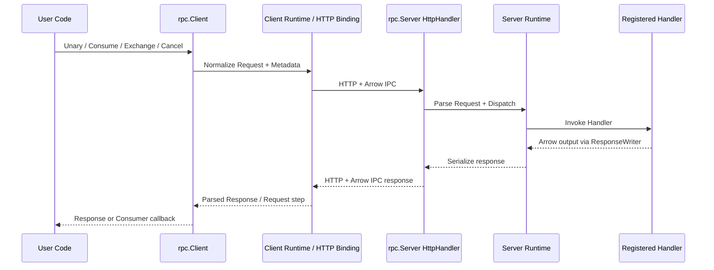
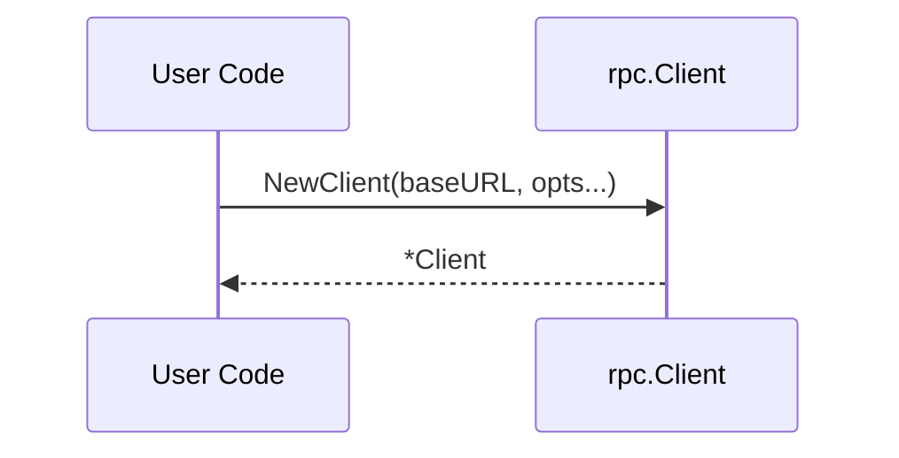
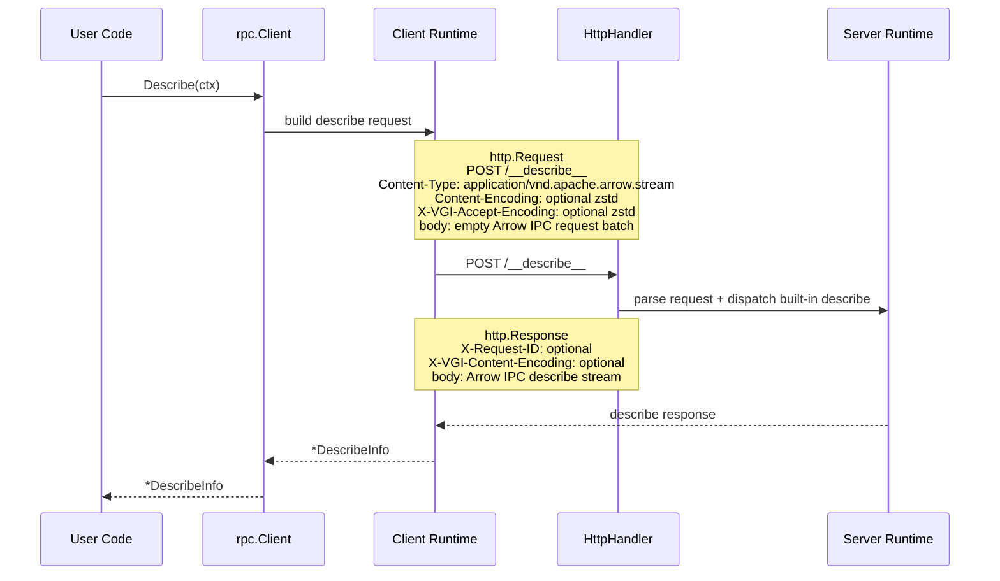
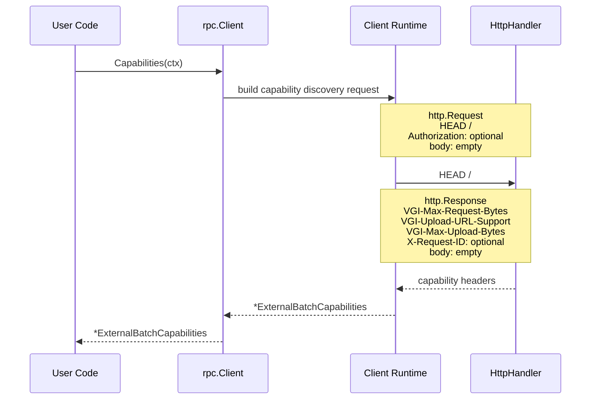
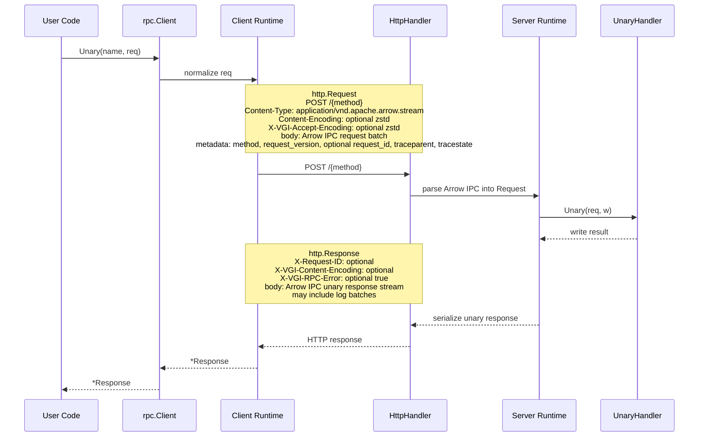
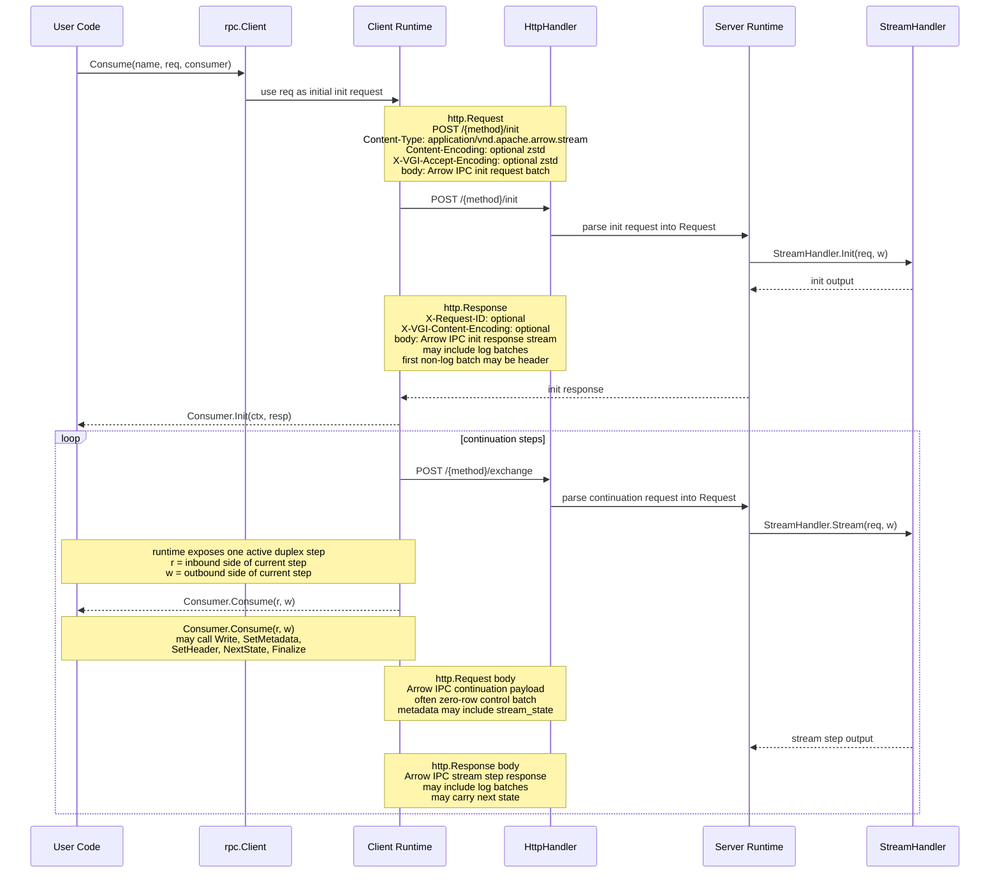
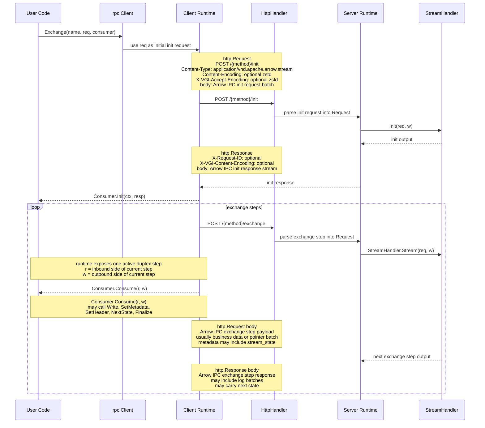
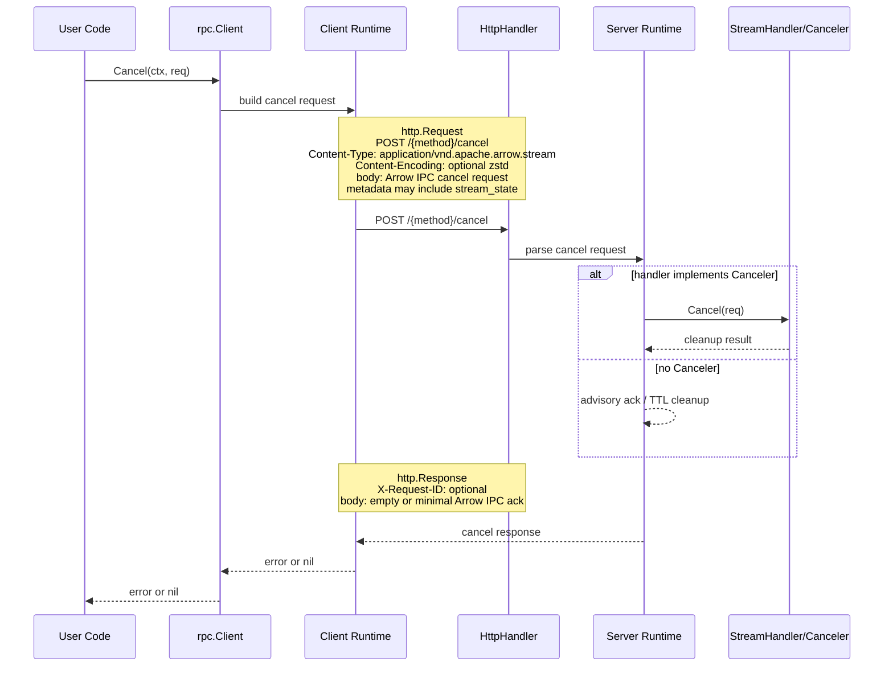
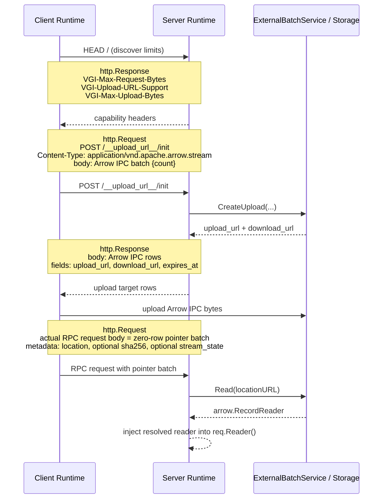

# RPC Client-Server Interaction

## Purpose

This document describes end-to-end interaction between:

- Go `rpc.Client`
- client runtime logic
- HTTP transport binding
- Go `rpc.Server`
- server runtime logic
- registered handlers

It focuses on the execution flow rather than on the standalone API shapes documented in `rpc-client.md` and `rpc-server.md`.

## Shared Principles

- The public API stays stateless.
- Continuation identity is carried explicitly in request and response state.
- Arrow IPC is the canonical request and response payload format.
- External batch storage is a transport optimization, not a handler concern.
- Handlers should normally see Arrow readers and writers, not raw pointer-batch mechanics.

## Mermaid Diagrams



### `NewClient(...)`



### `Describe(...)`



### `Capabilities(...)`



## Unary Flow

### 1. Caller invokes client API

```go
resp, err := client.Unary(name, req)
```

At this point:

- `req` is the outbound transport envelope
- `req.Reader()` supplies the outgoing Arrow payload
- `req.Metadata`, `req.Header`, and `req.State` contribute transport metadata

### 2. Client runtime builds HTTP request

The client runtime:

- normalizes the outbound request
- injects protocol metadata such as:
  - `vgi_rpc.method`
  - `vgi_rpc.request_version`
  - `vgi_rpc.request_id` when available
- serializes the Arrow IPC request body
- applies HTTP binding rules such as:
  - `Content-Type: application/vnd.apache.arrow.stream`
  - optional `Content-Encoding: zstd`
  - optional `X-VGI-Accept-Encoding: zstd`

### 3. HTTP transport sends request

The request is sent to:

- `POST /{method}`

### 4. Server HTTP binding parses request

The server runtime:

- validates transport metadata
- checks `vgi_rpc.request_version`
- parses the Arrow IPC body into a `Request`
- injects tracing and request ID context

### 5. Server dispatches handler

The server dispatches:

```go
h.Unary(req, w)
```

Where:

- `req` is the parsed inbound request envelope
- `w` is the server-side `ResponseWriter`

### 6. Handler writes unary result

The handler may:

- write zero or more data batches through `arrow.RecordWriter`
- call:
  - `SetMetadata(...)`
  - `SetHeader(...)`
  - `Log(...)`

### 7. Server runtime serializes unary response

The server runtime:

- serializes protocol log batches if any
- serializes the unary result Arrow IPC stream
- optionally compresses the HTTP response
- may emit:
  - `X-Request-ID`
  - `X-VGI-Content-Encoding`
  - `X-VGI-RPC-Error: true` for protocol error bodies over HTTP 200

### 8. Client runtime parses unary response

The client runtime:

- decompresses response if needed
- handles protocol log and error batches
- returns:

```go
*Response
```

Where:

- `Response.Reader()` exposes the unary data payload
- `Response.Header` carries unary header data
- `Response.Metadata` carries transport metadata
- `Response.IsFinal()` is always true for unary



## Producer Flow

### 1. Caller invokes producer API

```go
err := client.Consume(name, req, consumer)
```

The initial `req` is the outbound init request.

### 2. Client runtime sends init request

The client runtime:

- serializes the init request from `req`
- sends:
  - `POST /{method}/init`

### 3. Server runtime dispatches init

The server dispatches:

```go
h.Init(req, w)
```

The handler may:

- read init payload from `req.Reader()`
- set:
  - output schema through `SetOutputSchema(...)`
  - typed init header through `SetHeader(...)`
  - transport metadata
  - logs

### 4. Client runtime parses init result

The parsed init result becomes:

```go
resp *Response
```

Then the client runtime calls:

```go
consumer.Init(ctx, resp)
```

### 5. Client runtime runs continuation loop

For each continuation round:

1. client runtime opens one continuation HTTP exchange
2. server dispatches:
   ```go
   h.Stream(req, w)
   ```
3. client runtime exposes the active step to user code as:
   ```go
   consumer.Consume(r, w)
   ```

Client-side semantics inside `consumer.Consume(...)`:

- `r` is the inbound side of the current continuation step
- `w` is the outbound side of the same continuation step
- both belong to one active HTTP request/response exchange
- reads from `r.Reader()` may block until the server produces data
- writes to `w` may block until transport flow-control allows more outbound data
- client code should treat `(r, w)` as a duplex pair for one logical step

Producer-specific note:

- in many producer flows the outbound continuation payload is only a control or tick batch
- zero-row control batches are valid
- after the initial `POST /{method}/init`, all further rounds use `POST /{method}/exchange`
- the continuation loop is fully runtime-managed inside the single `client.Consume(...)` call

### 6. Stream completion

Completion happens when:

- the inbound step is final
- no further continuation state is provided
- the runtime exits the loop normally



## Exchange Flow

Exchange uses the same public client interface shape as producer:

```go
err := client.Exchange(name, req, consumer)
```

The difference is in step semantics.

### 1. Init phase

Exactly like producer:

- client sends `POST /{method}/init`
- server dispatches `h.Init(req, w)`
- client parses init result and calls:
  ```go
  consumer.Init(ctx, resp)
  ```

### 2. Exchange step loop

For each exchange round:

1. client runtime opens one exchange HTTP step
2. server dispatches:
   ```go
   h.Stream(req, w)
   ```
3. client runtime exposes the active step to user code as:
   ```go
   consumer.Consume(r, w)
   ```

Exchange-specific note:

- unlike producer, the outbound client-side step usually contains business data
- the shared `Consumer` interface is still sufficient because the data model is the same:
  - inbound `Request`
  - outbound `ResponseWriter`
- reads from `r.Reader()` and writes through `w` belong to the same active step and may overlap in time
- after the initial `POST /{method}/init`, all further rounds use `POST /{method}/exchange`
- the continuation loop is fully runtime-managed inside the single `client.Exchange(...)` call



## Cancel Flow

### 1. Caller invokes cancel

```go
err := client.Cancel(ctx, req)
```

Where:

- `req.State` identifies the active stream
- `req.Metadata` and `req.Header` may carry transport context

### 2. Client runtime sends cancel request

The HTTP binding sends:

- `POST /{method}/cancel`

### 3. Server runtime dispatches cancel

If the registered stream handler implements:

```go
type Canceler interface {
    Cancel(req *Request) error
}
```

then runtime invokes it.

Otherwise:

- cancel remains advisory
- the server may acknowledge it and rely on timeout or TTL cleanup



## External Batch Storage

External batch storage affects both client and server runtime, but should remain invisible to handlers whenever possible.

### Request externalization

If the client wants to send a large request payload:

1. client discovers capabilities through:
   - `HEAD /`
2. client sees:
   - `VGI-Max-Request-Bytes`
   - `VGI-Upload-URL-Support`
   - `VGI-Max-Upload-Bytes`
3. if upload externalization is needed, client calls:
   - `POST /__upload_url__/init`
4. server transport uses `WithExternalStorage(...)` service to create upload targets
5. client uploads Arrow IPC bytes to `upload_url`
6. client sends the real RPC call with a zero-row pointer batch containing:
   - `vgi_rpc.location`
   - optionally `vgi_rpc.location.sha256`
   - optionally `vgi_rpc.stream_state#b64`

### Server-side pointer resolution

When the server receives a pointer batch:

1. runtime detects `vgi_rpc.location`
2. runtime calls:
   ```go
   ExternalBatchService.Read(ctx, locationURL)
   ```
3. runtime obtains `arrow.RecordReader`
4. runtime injects that reader into `req.Reader()`
5. handler continues normally without knowing that external storage was used

### Response externalization

If the server wants to externalize a large response payload:

1. handler writes normal Arrow output through `ResponseWriter`
2. server runtime decides to externalize based on:
   - response size
   - capability limits
   - server policy
3. server runtime stores the Arrow IPC payload through external storage
4. server runtime returns a zero-row pointer batch containing:
   - `vgi_rpc.location`
   - optionally `vgi_rpc.location.sha256`
   - optionally `vgi_rpc.stream_state#b64`
5. client runtime resolves or follows the external payload according to transport rules



## Error and Log Propagation

### Logs

- handlers call `ResponseWriter.Log(...)`
- server runtime serializes protocol log batches
- client runtime consumes those batches and does not expose them through user-facing readers

### Errors

- handlers return `error`
- server runtime maps failures to protocol error batches or transport-native HTTP errors
- for HTTP after Arrow IPC response handling has begun, the server may use:
  - `HTTP 200`
  - `X-VGI-RPC-Error: true`
  - Arrow IPC error body
- client runtime converts protocol failures back to Go `error`

## Interaction Summary

The intended layering is:

1. user calls Go client API
2. client runtime normalizes transport envelope
3. HTTP binding serializes Arrow IPC
4. server HTTP binding parses Arrow IPC
5. server runtime dispatches registered handler
6. handler reads and writes Arrow-first abstractions
7. server runtime serializes result
8. client runtime parses result and exposes:
   - `*Response` for unary or init
   - `*Request` plus `ResponseWriter` inside streaming continuation callbacks

The important invariant is that handlers and consumers work against normalized transport envelopes, while protocol details such as compression, pointer batches, upload URLs, request IDs, and trace headers remain runtime concerns.
